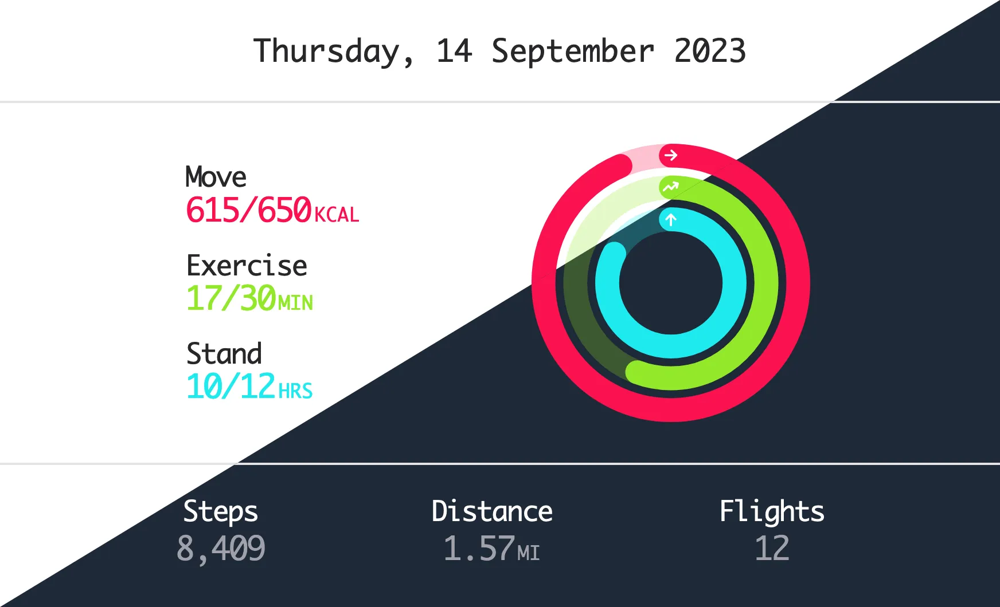

# Fitness Components

This provides two Web Components for fitness visualisations. You can use a fully
featured “fitness card” or just the activity rings on their own. The default
activity ring design is inspired by Apple Fitness.

## Installation

```bash
npm install git+https://github.com/trovster/fitness-visualisations.git --save
```

## Usage

These are [Web
Components](https://developer.mozilla.org/en-US/docs/Web/API/Web_Components) and
must be imported before the custom elements can be used.

```html
<script type="module">
  import 'fitness-visualisations/src/FitnessCard.js';
  import 'fitness-visualisations/src/FitnessRing.js';
</script>
```

Both the card and ring require the `move`, `exercise` and `stand` totals and goals.
The card has additional optional values. If you include the date, it appears as
a header. The `steps`, `distance` and `flights` data appear in the footer
section. The distance attribute should be provided **in meters**. By default,
this is converted to *miles*, but you can change this to kilometres using
`units="km"`.

```html
<fitness-card
  date="YYYY-MM-DD"
  units="km | miles"
  steps="0"
  distance="0"
  flights="0"
  move-total="0"
  move-goal="0"
  exercise-total="0"
  exercise-goal="0"
  stand-total="0"
  stand-goal="0"
></fitness-card>

<fitness-ring
  move-total="0"
  move-goal="0"
  exercise-total="0"
  exercise-goal="0"
  stand-total="0"
  stand-goal="0"
></fitness-ring>
```

You can provide a custom header by using the named `<slot>`. You can also change
the text for “move”, “exercise” and “stand”.

```html
<fitness-card>
  <div slot="header">The Custom Header</div>
  <div slot="move">Move</div>
  <div slot="exercise">Exercise</div>
  <div slot="stand">Stand</div>
</fitness-card>
```

The activity rings animation can be replayed when using the `replayable="true"`
attribute. When the activity rings are clicked, the animation is replayed in
reverse, then completed again.

The typeface and colours of the text and rings can be altered using CSS
variables. The `--fitness-value` controls the colour of the *values* in the
footer.

```css
--fitness-font: sans-serif;

--fitness-value: #9ca3af;
--fitness-move: #fa114f;
--fitness-exercise: #92e82a;
--fitness-stand: #1eeaef;

--fitness-ring-move: #fa114f;
--fitness-ring-exercise: #92e82a;
--fitness-ring-stand: #1eeaef;
```

If you provide icons, they can be styled using `--fitness-icon` CSS variable.

```css
fitness-ring [slot="icon-move"] {
    --fitness-icon: #B31162;
}
fitness-ring [slot="icon-exercise"] {
    --fitness-icon: #1FAD8F;
}
fitness-ring [slot="icon-stand"] {
    --fitness-icon: #1689A0;
}
```

You can target the styling of sections within the fitness card component using
the `::part` pseudo-element.

```css
fitness-card::part(header) {}
fitness-card::part(main) {}
fitness-card::part(ring) {}
fitness-card::part(footer) {}
```

## Development

### Linting and Formatting

To scan the project for linting and formatting errors, run:

```bash
npm run lint
```

To automatically fix linting and formatting errors, run:

```bash
npm run format
```

### Local Demo with `web-dev-server`

To start a local development server that serves the basic demo located in
`docs/index.html`, run:

```bash
npm start
```

### Tooling Configs

For most of the tools, the configuration is in the `package.json` to minimize
the amount of files in your project.

If you customize the configuration a lot, you can consider moving them to
individual files.
